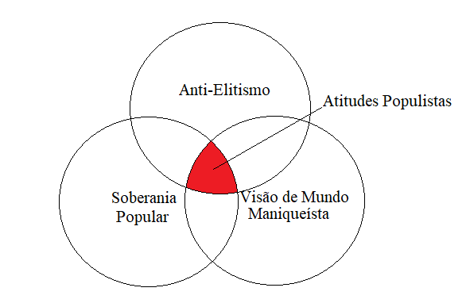

```{r setup, include=FALSE}
knitr::opts_chunk$set(echo = TRUE)
```


\begin{center}

{\Large \textbf{Anexo - Atitudes Populistas}}

Eduardo Ryô Tamaki \footnote{Aluno de Mestrado do Programa de Pós-Graduação em Ciência Política; E-mail: eduardo.rtamaki@gmail.com.}
	\vspace{10pt}
\end{center}


```{r echo=FALSE, warning=FALSE, message=FALSE, error=FALSE, include=FALSE}
library(tidyverse)
library(here)
library(haven)
library(RColorBrewer)
library(knitr)
library(kableExtra)
library(stargazer)
```

```{r cache = TRUE, echo=FALSE,  warning=FALSE, message=FALSE, error=FALSE, include=FALSE}
source(here::here("00 - Tratamento das Variáveis.R"), encoding = "UTF-8")
```


# Distribuição Das Variáveis 

Aqui irei plotar a distribuição das variáveis que compõem nossa variável de atitudes populistas. Para relembrar, selecionamos três variáveis, uma para cada dimensão:

1. **Maniqueísmo**:
|*M1*| (ESEB18 - Q401) - 
O que as pessoas chamam de compromisso em política é, na verdade, apenas uma forma de negociar os princípios;

2. **People-centrismo**: 
|*PC1*| (ESEB18 - Q406) -
O povo, e não os políticos, deveria tomar as decisões políticas mais importantes;

3. **Antielitismo**: 
|*AE1*| (ESEB18 - Q402) - 
A maior parte dos políticos não se importa com as pessoas; 

Partimos da ideia de que o populismo se encontra na interseção dessas três dimensões. Então, baseado em uma lógica não compensatória, para ser considerado populista é necessário pontuar alto em todas as dimensões. A imagem (Imagem 1) ajuda a ilustrar[^img].

Nossa variável de atitudes populistas utilizada aqui, para os gráficos, é a dividida em duas categorias (*não populistas* e *populistas*), seguindo sugestão feita por colegas do CECOMP e pelo próprio Bruno. 

[^img]: Há uma imagem semelhante no trabalho de Castanho Silva et al., 2018, e de Wuttke et al., 2020.

\FloatBarrier

{width=50%}

\pagebreak


## Atitudes Populistas

Aqui iremos dar uma olhada na distribuição da nossa variável de populismo. Como foi apontado pelos colegas, nossa distribuição justificaria uma recodificação da nossa variável de atitudes populistas.


```{r, echo=FALSE,  warning=FALSE, message=FALSE, error=FALSE, include=FALSE}
source(here::here("03 - Plot Distribuição das Variáveis.R"), encoding = "UTF-8")
```

```{r echo = FALSE, fig.cap="Distribuição Variável de Atitudes Populistas", fig.align='center'}
plt_pop_t
```

```{r, echo = FALSE, results = 'asis', message=FALSE, warning=FALSE, fig.pos="p"}

df_pop_or$percents <- round(df_pop_or$percents, 2)

kable(df_pop_or, caption = "Distribuição da Variável Atitudes Populistas", col.names = c("Score", "Contagem", "Porcentagem"), "latex", booktabs = T) %>% kable_styling(position = "center")
```

Como podemos ver, nossos extremos concentram cerca de **50%** dos casos, enquanto o resto é distribuido ao longo dos outros 14 valores. Levando em consideração isso, juntamente das sugestões dos colegas, mais a ideia de se estabelecer um "minimo" para ser considerado populista (a partir de uma abordagem não compensatória multiplicativa), optei por dividir nossa variável em **duas categorias** (sugestão do Bruno), os populistas e os não populistas. Aqui, populistas seriam aqueles que obtiveram a nota minima de 0.75 em todas as dimensões.

A distribuição da variável se encontra abaixo. Podemos perceber que, dessa forma, nossa distribuição fica praticamente em *50%-50%*.

```{r echo = FALSE, fig.cap="Distribuição Variável de Atitudes Populistas 2 Categorias", fig.align='center'}
plt_pop_2c
```

```{r, echo = FALSE, results = 'asis', message=FALSE, warning=FALSE, fig.pos="p"}

df_pop_2c$percent <- round(df_pop_2c$percent, 2)

kable(df_pop_2c, caption = "Distribuição da Variável de Atitudes Populistas 2 Categorias", col.names = c("Score", "Contagem", "Porcentagem"), "latex", booktabs = T) %>% kable_styling(position = "center")
```


\pagebreak
\FloatBarrier

## Maniqueísmo

  Abaixo temos o gráfico da distribuição da dimensão de maniqueísmo juntamente de uma tabela com os valores e porcentagens. Uma breve análise nos permite concluir que cerca de **69%** dos entrevistados possuem uma igual ou superior a *0.75*, o que significaria que cerca de **69%** dos entrevistados concordam com a afirmação de que *"O que as pessoas chamam de compromisso em política é, na verdade, apenas uma forma de negociar os princípios"*.
  
```{r, echo=FALSE,  warning=FALSE, message=FALSE, error=FALSE, include=FALSE}
source(here::here("04 - Plot.R"), encoding = "UTF-8")
```

```{r echo = FALSE, fig.cap="Distribuição de Dimensão de Maniqueísmo", fig.align='center'}
plot_maniq
```


```{r, echo = FALSE, results = 'asis', message=FALSE, warning=FALSE, fig.pos="p"}

df_dim_pop$percent <- round(df_dim_pop$percent, 2)

kable(df_dim_pop, caption = "Distribuição da Dimensão de Maniqueísmo", col.names = c("Score", "Contagem", "Porcentagem"), "latex", booktabs = T) %>% kable_styling(position = "center")
```

### Maniqueismo e Atitudes Populistas

Abaixo, temos gráfico da distribuição da variável da dimensão de maniqueísmo por categorias de populismo. Como se é de esperar, devido a codificação da nossa variável de populismo (2 categorias), só temos populistas dentre aqueles que pontuaram **no minimo** *0.75* na dimensão de Maniqueísmo.

```{r echo = FALSE, fig.cap="Distribuição de Dimensão de Maniqueísmo por Categorias de Populismo", fig.align='center'}
plot_maniq_pop_2c
```

\pagebreak
\FloatBarrier

## People-centrism

Na dimensão de People-Centrism, podemos ver que cerca de **78%** dos entrevistados possuem uma nota igual ou maior que *0.75*, em outras palavras, **78%** dos entrevistados concordam com a afirmação de que "*O povo, e não os políticos, deveria tomar as decisões políticas mais importantes*".

```{r echo = FALSE, fig.cap="Distribuição de Dimensão de People-Centrism", fig.align='center'}
plot_pc
```


```{r, echo = FALSE, results = 'asis', message=FALSE, warning=FALSE, fig.pos="p"}
df_pc$percent <- round(df_pc$percent, 2)

kable(df_pc, caption = "Distribuição da Dimensão de People-Centrism", col.names = c("Score", "Contagem", "Porcentagem"), "latex", booktabs = T) %>% kable_styling(position = "center")
```


### Peopl-centrism e Populismo

Aqui temos gráfico da distribuição da variável da dimensão de people-centrism por categorias de populismo. Como se é de esperar, devido a codificação da nossa variável de populismo (2 categorias), só temos populistas dentre aqueles que pontuaram **no minimo** *0.75* na dimensão de people-centrism.
```{r echo = FALSE, fig.cap="Distribuição de Dimensão de People-Centrism por Categorias de Populismo", fig.align='center'}
plot_pc_pop_2c
```


\pagebreak 

\FloatBarrier

## Antielitismo

Na dimensão de Antielitismo, podemos ver que cerca de **80%** dos entrevistados possuem uma nota igual ou maior que *0.75*, em outras palavras, **80%** dos entrevistados concordam com a afirmação de que "*A maior parte dos políticos não se importa com as pessoas*".

```{r echo = FALSE, fig.cap="Distribuição de Dimensão de Antielitismo", fig.align='center'}
plot_ae
```

```{r, echo = FALSE, results = 'asis', message=FALSE, warning=FALSE, fig.pos="p"}
df_ae$percent <- round(df_ae$percent, 2)

kable(df_ae, caption = "Distribuição da Dimensão de Antielitismo", col.names = c("Score", "Contagem", "Porcentagem"), "latex", booktabs = T) %>% kable_styling(position = "center")
```


### Antielitismo e Populismo

Aqui temos gráfico da distribuição da variável da dimensão de antielitismo por categorias de populismo. Como se é de esperar, devido a codificação da nossa variável de populismo (2 categorias), só temos populistas dentre aqueles que pontuaram **no minimo** *0.75* na dimensão de antielitismo.

```{r echo = FALSE, fig.cap="Distribuição de Dimensão de Antielitismo por Categorias de Populismo", fig.align='center'}
plot_ae_pop_2c
```

\pagebreak
\FloatBarrier


## Populistas de Direita x de Esquerda

O próximo gráfico nos ajuda a ver a distribuição da variável de atitudes populistas por posição ideológica, nos permitindo ver a quantidade de pessoas de direita, esquerda e centro, por categoria de populismo.

```{r echo = FALSE, fig.cap="Distribuição de Atitudes Populistas por Posição Ideológica ", fig.align='center'}
plot_2c_id
```
O número de populistas de esquerda e direita se distribui da seguinte maneira:

```{r, echo = FALSE, results = 'asis', message=FALSE, warning=FALSE, fig.pos="p"}
kable(n_pop_id, caption = "N de Populistas de Esquerda e Direita", col.names = c("Ideologia", "Número de Pessoas"), "latex", booktabs = T) %>% kable_styling(position = "center")
```

Com base no gráfico, podemos perceber que, dentre os populistas (1), cerca de **18%** são de direita, enquanto apenas **7%** são de esquerda. ***Mas, esses de Esquerda são Petistas?*** Dos *populistas de esquerda*, apenas **35** são petistas.


\pagebreak
\FloatBarrier

## Populismo e Educação

Uma breve analise do gráfico abaixo não nos permite concluir se populistas são menos ou mais escolarizados do que os não populistas.

```{r echo = FALSE, fig.cap="Distribuição de Atitudes Populistas por Faixa de Educação", fig.align='center'}
plot_ed_pop
```


```{r, echo = FALSE, results = 'asis', message=FALSE, warning=FALSE, fig.pos="p"}
kable(df_ed_pop, caption = "Educação entre os Populistas (Pop = 1)", col.names = c("Faixa de Educação", "Populistas", "Não Populistas"), "latex", booktabs = T) %>% kable_styling(position = "center")
```

\pagebreak
\FloatBarrier

# Regressões 

Aqui irei plotar rapidamente as regressões, conforme combinamos. No entanto, não irei interpreta-las, devido ao grande número de tabelas.

## Testes Sugeridos por Bruno

Os testes sugeridos pelo Bruno foram:

* Transformar a variável de *Atitudes Populistas* em duas categorias;
* Incluir no modelo, do lado das variáveis independentes:
  - Corrupção: (ESEB18 - P12) *Você diria que a corrupção no Brasil é um problema muito sério, sério, pouco sério ou não é um problema sério*;
  - Faixa de Renda: (d9b_faixa_rendaf);
  - PC;
  

```{r echo=FALSE, warning=FALSE, message=FALSE, error=FALSE, include=FALSE}
m_2c <- glm(voto_b ~ pop_2c * ideo2.2 + sexo + id + ed, 
            data = e19,
            na.action = na.omit,
            family = binomial(link = "logit"),
            maxit = 100)
exp1 <- exp(m_2c$coefficients)
p.5 <- list(summary(m_2c)$coefficients[,4])
```

```{r, echo=FALSE, results='asis', warning=FALSE, message=FALSE, fig.cap="Regressão: Regressão Atitudes Populistas 2 Categorias e Voto em 2018"}

stargazer(title = "Regressão Atitudes Populistas 2 Categorias com as Variáveis Dependentes Originais",
          m_2c, 
          header = F, type="latex",
          font.size = 'small',
          dep.var.caption = c("Variável Dependente"),
          dep.var.labels = "Voto em Bolsonaro",
          perl = TRUE,
          covariate.labels=c("Populista",
                             "Ideologia: Direita",
                             "Ideologia: Esquerda",
                             "Sexo: Ser Homem",
                             "Idade",
                             "Educação",
                             "Ser de Direita e Populista",
                             "Ser de Esquerda e Populista"
          ),
          apply.coef = exp,
          p.auto = F,
          p = p.5,
          report = ('vc*sp')
)


```


```{r echo=FALSE, warning=FALSE, message=FALSE, error=FALSE, include=FALSE}

# + PC2 + Renda e Corrupção
m_2c.2 <- glm(voto_b ~ pop_2c * ideo2.2 + sexo + id + ed + PC2 + fx_renda + corrup1, 
              data = e19,
              na.action = na.omit,
              family = binomial(link = "logit"),
              maxit = 100)
summary(m_2c.2)
exp1 <- exp(m_2c.2$coefficients)
p.5 <- list(summary(m_2c.2)$coefficients[,4])
```


```{r, echo=FALSE, results='asis', warning=FALSE, message=FALSE, fig.cap="Regressão: Regressão Atitudes Populistas 2 Categorias e Voto em 2018", fig.width=2}

stargazer(title = "Regressão Atitudes Populistas 2 Categorias com acrescimo de PC2, Corrupção e Renda", 
          m_2c.2, 
          header = F, type="latex",
          dep.var.caption = c("Variável Dependente"),
          dep.var.labels = "Voto em Bolsonaro",
          perl = TRUE,
          font.size = 'small',
          no.space = T,
          covariate.labels=c("Populista",
                             "Ideologia: Direita",
                             "Ideologia: Esquerda",
                             "Sexo: Ser Homem",
                             "Idade",
                             "Educação",
                             "PC2",
                             "Renda",
                             "Corrupção",
                             "Ser de Direita e Populista",
                             "Ser de Esquerda e Populista"
          ),
          apply.coef = exp,
          p.auto = F,
          p = p.5,
          report = ('vc*sp')
)
```

## Regressão com Variável de Atitudes Populistas como Dependente

Aqui, conforme sugerido, a nossa *variável dependente* será **atitudes populistas**. Rodei duas regressões, uma para a *variável original* (escala de 17 itens) e outra para a *variável de duas categorias*.

```{r, echo=FALSE, results='asis', warning=FALSE, message=FALSE, fig.cap="Regressão: Regressão Atitudes Populistas 2 Categorias Como Variável Dependente"}
m_pop2c <- glm(pop_2c ~ ideo2.2 + sexo + id + ed + fx_renda + corrup1, 
              data = e19,
              na.action = na.omit,
              family = binomial(link = "logit"),
              maxit = 100)
exp1 <- exp(m_pop2c$coefficients)
p.5 <- list(summary(m_pop2c)$coefficients[,4])

stargazer(title = "Regressão Atitudes Populistas 2 Categorias como Variável Dependente", 
          m_pop2c, 
          header = F, type="latex",
          dep.var.caption = c("Variável Dependente"),
          dep.var.labels = "Ser Populista (Categórica)",
          perl = TRUE,
          font.size = 'small',
          covariate.labels=c("Ideologia: Direita",
                             "Ideologia: Esquerda",
                             "Sexo: Ser Homem",
                             "Idade",
                             "Educação",
                             "Renda",
                             "Corrupção"
          ),
          apply.coef = exp,
          p.auto = F,
          p = p.5,
          report = ('vc*sp')
)


```


```{r, echo=FALSE, results='asis', warning=FALSE, message=FALSE, fig.cap="Regressão: Regressão Atitudes Populistas (17 Itens) Como Variável Dependente"}
modelo <- lm(pop_4n ~ ideo2.2 + sexo + id + ed + fx_renda + corrup1,
             data = e19, na.action = na.omit)
stargazer(title = "Regressão Atitudes Populistas (17 itens) como Variável Dependente", 
          modelo, 
          header = F, type="latex",
          font.size = 'small',
          dep.var.caption = c("Variável Dependente"),
          dep.var.labels = "Populismo (17 Itens)",
          perl = TRUE,
          covariate.labels=c("Ideologia: Direita",
                             "Ideologia: Esquerda",
                             "Sexo: Ser Homem",
                             "Idade",
                             "Educação",
                             "Renda",
                             "Corrupção"
          )
)
```

